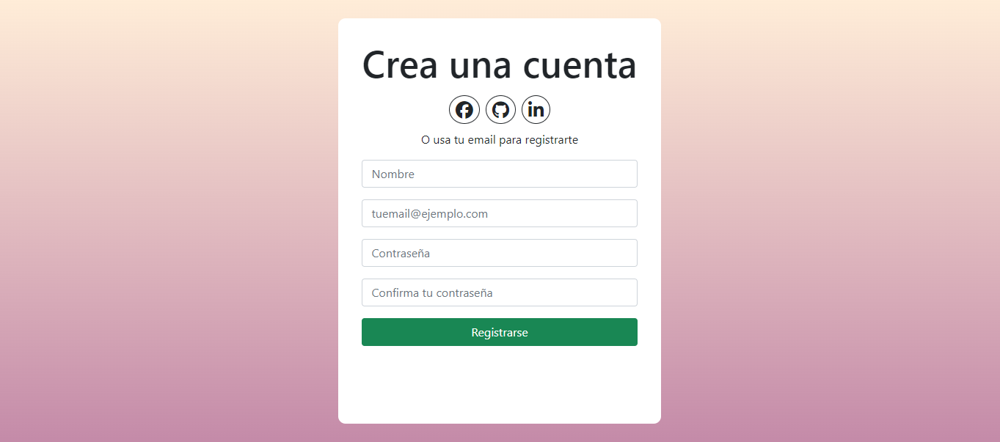

# Desafío 2 - Estado de los componentes y eventos

Se realiza una aplicación en React que permite al usuario validar un formulario de registro utilizando los eventos onChange y onSubmit.

## Tecnologías utilizadas:
- React
- Vite
- Bootstrap
- Font Awesome

